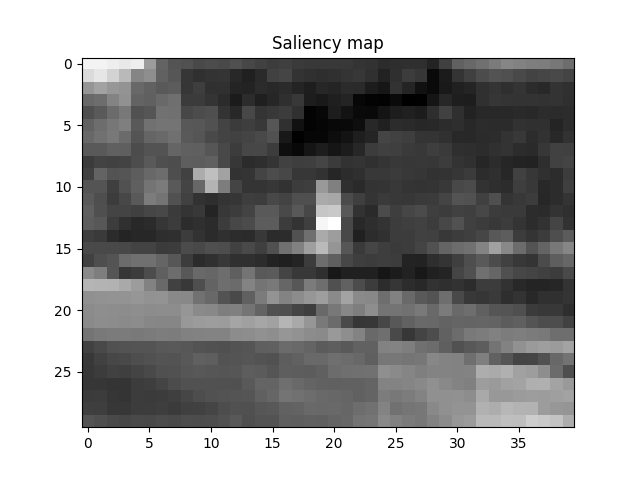
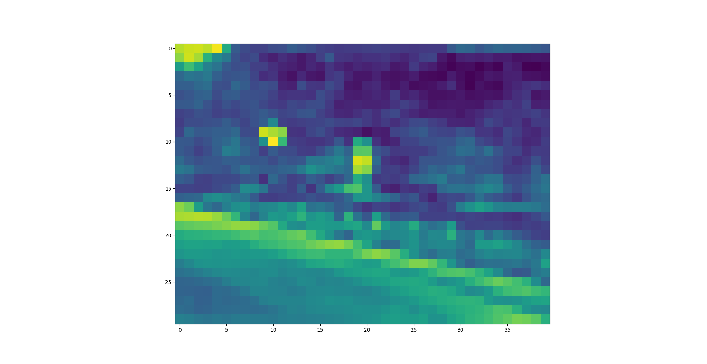
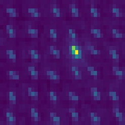

# itti_Salience_method_python3

Hello!

if you are interested in Itti Saliency implementation on Python3, this code would help you :-)🤗

I tried to not involve classes(which is hard to read sometime) and made a universal function by which you can get anything youwant.🥰

If you don't need to examine your midway out put, just simply set parameter 'ifshow' as False.😲

Be aware that in this implementation, Itti Saliency map cannot find the difference between red and green or yellow and blue due to Itti's original method. Some other implementation, it could be red-blue and green-yellow, which is wrong if you view it biologically.🤓

I also upload a presentation file of explaining Itti's method and describing this code output.😎

Anyway, havefun!😉

## Prerequisite

python >= 3.8

opencv-python or opencv-contrib-python == 4.9.0.80

(I would recommend the second package, if you want to use more salience-computing functions or any other functions which are not contained in the official package.)

numpy == 1.26.4

scipy == 1.12.0

and a heart full of bravery😎

## Some Test Case

